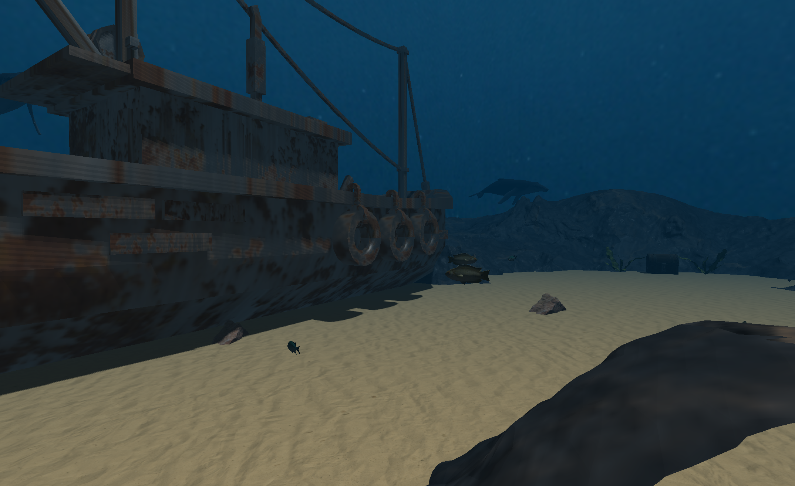
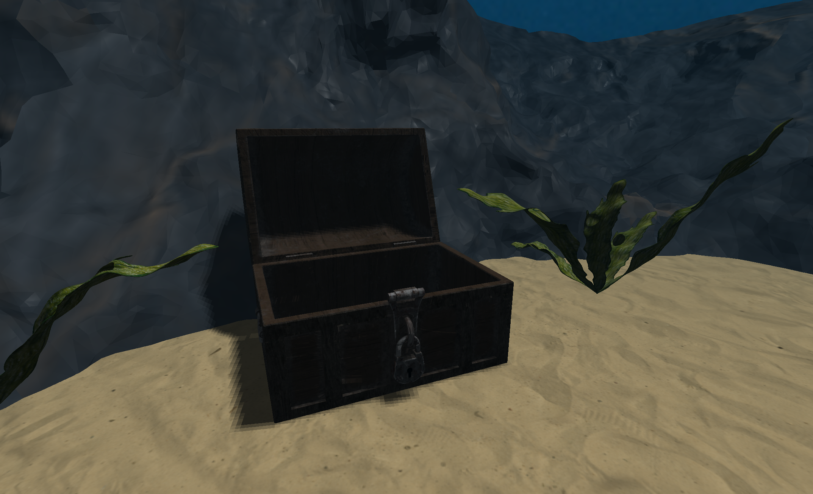
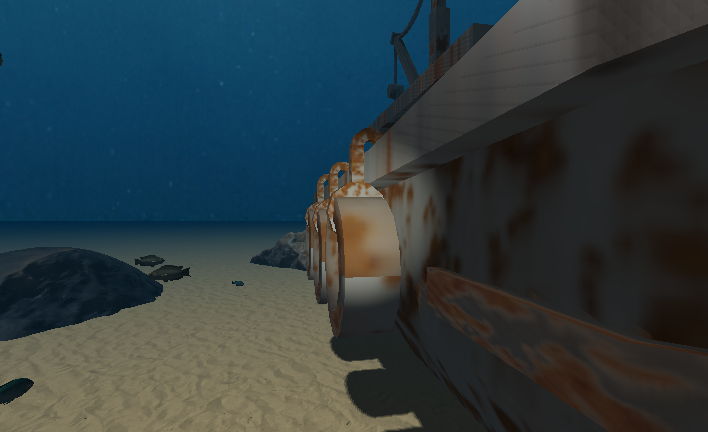
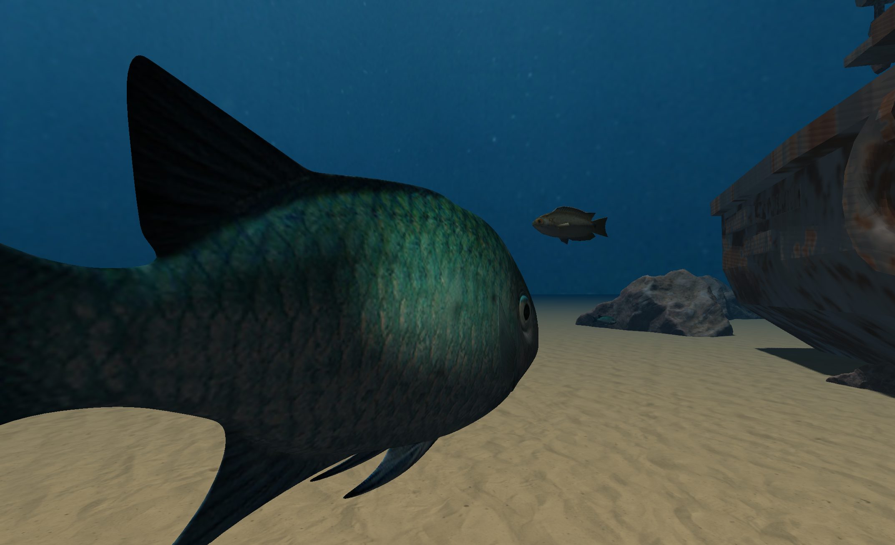

# Underwater World
Projekt na przedmiot Grafika Komputerowa.

## Autorzy

- Natalia Stefańska
- Mateusz Zaręba

## Metody obowiązkowe

1. Normal Mapping
 - zastosowane na co najmniej dwóch różnych materiałach: zardzewiały metal (wrak) i skała (formacje skalne)
 - odczytywane z tekstury, rozpakowywane z zakresu [0,1] do [-1,1] i przekształcane przez macierz TBN (tangent-bitangent-normal) do przestrzeni świata
 - tangenty i bitangenty obliczane automatycznie przez Assimp przy ładowaniu modeli (`aiProcess_CalcTangentSpace`)
 - dla dna piaskowego - dodatkowe zniekształcenie przez flowmapę, co daje efekt falującego piasku 

2. PBR Lighting
 - shader PBR w wariancie metallic/roughness oparty na modelu Cook-Torrance BRDF
 - trzy funkcje: rozkład normalnych (D), funkcja geometrii (G), aproksymacja Fresnela (F)
 - cztery tekstury per materiał: albedo, normal map, metallic map, roughness map
 - materiały PBR w scenie: zardzewiały metal na wraku, skała na formacjach skalnych z dedykowaną czarną mapą metaliczności
 - tone mapping Reinharda i korekcja gamma na końcu pipeline'u
 - bazowa reflektywność F0: 0.04 dla dielektryków, kolor albedo dla metali

3. Quaternion Camera Control
 - kamera sterowana kwaternionami (`glm::quat`)
 - obrót kamery na podstawie ruchu myszy: osobne kwaterniony dla yaw (oś Y) i pitch (oś X), składane multiplikatywnie
 - pitch ograniczony do +/-89 stopni, żeby uniknąć odwrócenia kamery
 - ruch kamery (`WASD`/`QE`) w kierunkach wyznaczanych przez orientację kwaternionową
 - kamera nie schodzi poniżej poziomu dna (`y = -1.0`)

4. Shadow Mapping
 - mapa cieni o rozdzielczości 2048x2048 renderowana do osobnego FBO z teksturą głębi
 - scena renderowana z punktu widzenia światła 
 - obiekty rzucające cienie: wrak, kufer, 11 skał
 - filtrowanie PCF 3x3 (Percentage-Closer Filtering) - uśrednianie 9 próbek dla wygładzenia krawędzi cieni
 - zależny od kąta między normalną a kierunkiem światła - redukcja shadow acne
 - fragmenty poza zasięgiem mapy cieni nie są zacieniowane
 - cienie zintegrowane ze wszystkimi shaderami: PBR, flowmap, normalmap_flow

5. Parallel Transport Frames
 - krzywa Catmull-Rom z 6 punktami kontrolnymi definiująca zamkniętą trajektorię ryby
 - ramki transportu równoległego (PTF) wyznaczające stabilną orientację wzdłuż krzywej
 - prosta animacja pływania - sinusoidalne kołysanie ciała ryby 
 - zachowanie ucieczki: gdy kamera jest bliżej niż 3 jednostki, ryba przyspiesza 3x i losowo przesuwa punkty kontrolne trajektorii
 - płynne przejścia między stanem normalnym a ucieczką przez interpolację liniową (`glm::mix`)

6. Underwater Skybox/Cubemap

 - cubemapa złożona z 6 tekstur (`px`, `nx`, `py`, `ny`, `pz`, `nz`) renderowana jako tło sceny
 - skybox nie przesuwa się razem z kamerą
 - rysowany z `glDepthFunc(GL_LEQUAL)` żeby był zawsze za wszystkimi obiektami

## Metody dodatkowe
- A14 - Flow-map driven underwater current distortion
  - tekstura flowmapy (`flowmap.png`) przechowuje wektory przepływu w kanałach R i G
  - wartości odczytane z tekstury są przeskalowane z [0,1] na [-1,1]
  - kierunek przepływu jest mieszanką flowmapy (30%) i kierunku sterowanego strzałkami (70%) - użytkownik ma wyraźny wpływ na kierunek prądu
  - tekstura koloru i mapa normalnych są przesuwane tymi samymi UV = spójny efekt ruchu
  - zastosowane na dwóch shaderach: `shader_flowmap` (dno piaskowe) i `shader_normalmap_flow` (obiekty 3D: skały, kufer)
  - parametry regulowane w czasie rzeczywistym: prędkość (klawisze 1/2), skala przesunięcia (3/4), kierunek (strzałki), reset (R)
  - aktualne parametry prędkości i skali przesunięcia wyświetlane w tytule okna

- B09 - Ładowanie i wyświetlanie modeli OBJ

  - ładowanie modeli przez bibliotekę Assimp 
  - dwie funkcje ładowania: `loadMesh` (pojedynczy mesh z pliku) i `loadAllMeshes` (wszystkie meshe - dla modeli wieloczęściowych jak wrak czy kufer)
  - każdy model z co najmniej jedną teksturą, odpowiednimi transformacjami (translate, rotate, scale) i przypisanym shaderem

### Załadowane modele (9 plików OBJ):

| Model | Plik | Shader | Tekstury |
|---|---|---|---|
| Wrak statku | Boat Texture 1.obj (wiele meshy) | PBR | albedo, normal, metallic, roughness | 
| Skała | sasso14.obj | normalmap_flow | albedo, normal | 
| Kufer | chest_low.obj (wiele meshy, mesh 14 = wieczko) | normalmap_flow | albedo, normal |
| Wieloryb (×3) | 10054_Whale_v2_L3.obj | tex | albedo |
| Ryba gatun. 1 | 12265_Fish_v1_L2.obj | tex | albedo | 
| Ryba gatun. 2 | fish.obj | tex | albedo |
| Ryba gatun. 3 | 13007_Blue-Green_Reef_Chromis_v2_l3.obj | tex | albedo |
| Formacja skalna | SfM04_001b.obj | PBR | albedo, normal, metallic, roughness |
| Wodorosty | seaweedList.obj (5 meshy) | tex + alpha blending | albedo z kanałem alpha |

## Interakcje 

1. Sterowanie prądem wodnym

 - klawisze `1`/`2`: zmniejsz/zwiększ prędkość przepływu
 - klawisze `3`/`4`: zmniejsz/zwiększ skalę przesunięcia tekstur
 - strzałki: zmiana kierunku prądu
 - `R`: reset wszystkich parametrów do wartości domyślnych
 - efekt widoczny na piasku (dno), skałach i kufrze

2. Latarka

 - klawisz `L`: włącz/wyłącz
 - podąża za pozycją i kierunkiem patrzenia kamery
 - ciepły kolor (1.0, 1.0, 0.8)
 - działa na wszystkich obiektach

3. Otwieranie kufra

 - automatyczne przy zbliżeniu kamery (próg 2.5 jednostki)
 - wieczko (mesh nr 14) obraca się wokół pivota do 110°
 - zamyka się po odejściu kamery

4. Ryba uciekająca od kamery

 - ryba PTF porusza się po krzywej Catmull-Rom
 - przy zbliżeniu kamery na mniej niż 3 jednostki: przyspieszenie 3x + losowe przesunięcie punktów kontrolnych

## Sterowanie sceną

| Klawisz | Akcja |
|---|---|
| W/A/S/D | Ruch kamery przód/lewo/tył/prawo |
| Q/E | Ruch kamery dół/góra |
| Mysz | Obrót kamery (yaw + pitch) |
| Left Shift | Sprint - 3x szybszy ruch |
| L | Włącz/wyłącz latarkę nurka |
| 1 / 2 | Zmniejsz / zwiększ prędkość prądu wodnego |
| 3 / 4 | Zmniejsz / zwiększ skalę przesunięcia prądu |
| Strzałki ↑↓←→ | Zmiana kierunku prądu wodnego |
| R | Reset parametrów prądu do domyślnych |
| TAB | Pokaż/ukryj kursor myszy |
| ESC | Zamknij aplikację |

## Elementy sceny

 - dno z teksturą piasku
 - wrak statku
 - kufer z animowanym wieczkiem
 - 11 skał rozmieszczonych przy wraku 
 - 2 formacje skalne powstałe z modelu koralu 
 - 3 wieloryby pływające po elipsach z różnymi trasami, prędkościami i wysokościami - przyspieszają przy zbliżeniu kamery
 - 7 ryb statycznych w 2 gatunkach z animacją unoszenia i machania
 - 1 ryba dynamiczna z ucieczką od kamery
 - 2 wodorosty umieszczone przy kufrze
 - Skybox

## Zrzuty ekranu

## Budowanie projektu

1. Sklonuj repozytorium
2. Skopiuj folder `dependencies` do głównego folderu projektu
   - opcja A: pobierz z Google Drive: https://drive.google.com/drive/folders/1z2e5KhtTqW_80CQfWOUV8STVeHY5R1rg?usp=sharing
   - opcja B: skopiuj bezpośrednio z projektów ćwiczeniowych
3. Otwórz `underwater_world\underwater_world.sln` w Visual Studio 2022+
4. Skompiluj i uruchom

